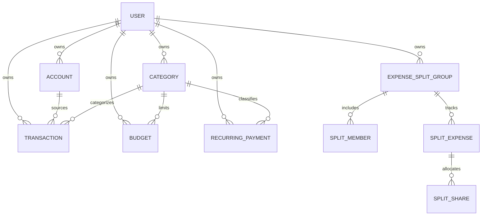

# System Architecture & Technical Specification

## 1. Executive Summary

This document specifies the target production architecture for transforming the legacy Expense Tracker application into a high-performance, resilient, and aesthetically refined personal finance platform. 

The architecture bridges the legacy client-side prototype (vanilla HTML/JS with unstyled jsPDF generation and rudimentary split math) into a modern full-stack web application adhering to the attached research specification: **Next.js (App Router) + TypeScript + Tailwind CSS (v4) + Prisma ORM + SQLite/PostgreSQL + pdf-lib + TanStack Query + Lucide Icons**.

---

## 2. Target System Architecture

```mermaid
graph TD
    subgraph Client ["Client Layer (Browser / Mobile / Desktop)"]
        UI[Next.js 15/16 App Router UI]
        Zustand[Client State: Theme, Modals, Hotkeys]
        TQ[TanStack Query: Server Cache & Sync]
        IDB[IndexedDB Cache / Offline Storage]
        UI --> Zustand
        UI --> TQ
        TQ --> IDB
    end

    subgraph API ["Next.js Server & Route Handlers (/api/v1)"]
        AuthMiddleware[Auth & Session Verification]
        Validation[Zod Request Validation]
        
        subgraph DomainServices ["Domain Services Layer"]
            MoneyService[Money & Currency Engine (Integer Minor Units)]
            TxService[Transaction & Split Engine]
            BudgetService[Budget & Limit Engine]
            RecurringService[Recurring Scheduler Engine]
            AnalyticsService[Financial Analytics & Metrics]
            PdfService[PDF Generation Engine (pdf-lib)]
            ImportExportService[CSV / JSON ETL Engine]
        end
        
        PrismaClient[Prisma Data Access Layer]
    end

    subgraph Persistence ["Persistence Layer"]
        DB[(Relational Database: SQLite / PostgreSQL)]
    end

    UI -->|HTTPS / JSON REST API| AuthMiddleware
    AuthMiddleware --> Validation
    Validation --> DomainServices
    DomainServices --> PrismaClient
    PrismaClient --> DB
    PdfService -->|Binary PDF Stream| UI
```

---

## 3. Technology Stack & Selection Rationale

| Layer | Selected Technology | Version | Rationale & Trade-offs |
| :--- | :--- | :--- | :--- |
| **Framework** | **Next.js (App Router)** | `v15.x` | Industry standard React SSR/SSG framework. Provides unified API routes, server components for SEO/speed, and zero-config deployment. |
| **Language** | **TypeScript** | `v5.x` | Strict type safety across UI, API, domain math, and database schemas. Prevents runtime errors in financial operations. |
| **Styling** | **Tailwind CSS** | `v4.x` | Utility-first, zero runtime overhead. Easily customized with semantic design tokens for "Asian Apple" minimalism and WCAG 2.2 AA light/dark modes. |
| **Icons** | **Lucide React** | Latest | Consistent, clean 24px/16px line icons matching the minimalist Apple/Japanese design aesthetic. |
| **State Management** | **TanStack Query v5** + **Zustand** | Latest | TanStack Query provides deterministic caching, background refetching, and mutations. Zustand handles ephemeral UI state (sidebar, filters, command palette). |
| **Database & ORM** | **Prisma ORM** + **SQLite / PostgreSQL** | `v5.x` | Type-safe queries, automated migrations, declarative schema. Uses SQLite out-of-the-box for instant local zero-config execution and seamlessly scales to Postgres (Supabase). |
| **Money Handling** | **Minor-unit Integer Math & Decimal abstraction** | Internal Utility | Eliminates JavaScript floating-point errors (e.g. `0.1 + 0.2 === 0.30000000000000004`). All calculations occur in integer minor units (cents/paise) with explicit rounding rules. |
| **PDF Generation** | **pdf-lib** | Latest | Pure TypeScript/JavaScript vector PDF generator without native binary dependencies (unlike Puppeteer/Cairo). Supports crisp tables, pagination (`Page X of Y`), repeated headers, and clean typography. |
| **Validation** | **Zod** | `v3.x` | Strict runtime schema validation for API inputs, query params, CSV rows, and form inputs. |
| **Testing** | **Vitest** + **React Testing Library** | Latest | Ultra-fast unit & integration testing for money calculations, recurring rules, split mathematics, and UI flows. |

---

## 4. Visual Design System: "Asian Apple" Minimalist Aesthetic

The design philosophy combines **Apple-like clarity**, **Japanese/Asian architectural minimalism**, and **soft premium warmth**:
- **Backgrounds**: Soft warm off-whites in light mode (`#F8F9FA` / `#F5F5F7`), deep warm slate/charcoal in dark mode (`#0F1115` / `#161920`).
- **Surfaces**: Crisp cards with subtle hairline borders (`border-stone-200 / border-neutral-800`), refined micro-shadows, and intentional generous whitespace.
- **Typography**: Clean sans-serif hierarchy (`Inter` / system font stack) with tight tracking on numbers (`tabular-nums`) for perfect financial column alignment.
- **Accents**: Soft indigo/slate primary (`#2563EB` / `#3B82F6`), subtle sage/emerald for income/savings, warm crimson for expenses, soft amber for budget warnings. Accessible WCAG AA contrast (≥ 4.5:1).
- **Micro-interactions**: Subtle hover states, smooth drawer/dialog transitions, optimistic UI updates, and zero visual clutter.

---

## 5. Domain Entities & Database Schema

The relational schema is normalized with foreign keys, cascading deletes, and indexed query paths:



### Core Entities:
1. **User**: Authentication boundary, preferences (base currency: INR, USD, EUR, etc., date format, theme).
2. **Account**: Financial accounts (Cash, Bank Checking, Credit Card, Savings, Investment) with current balance tracking.
3. **Category**: Hierarchical (parent/child) with type (`EXPENSE`, `INCOME`), icon name, and color token.
4. **Transaction**: Core ledger record:
   - `amount`: BigInt / Integer minor units (e.g. 100000 = ₹1,000.00).
   - `currency`: ISO 4217 code (INR, USD, etc.).
   - `type`: `EXPENSE`, `INCOME`, `TRANSFER`.
   - `date`: Timestamp.
   - `accountId`, `toAccountId` (for transfers).
   - `categoryId`, `payee`, `notes`, `tags`.
   - `isRecurring`, `recurringId`.
5. **Budget**: Target limit per category or global monthly period with rollover flags.
6. **RecurringPayment**: Subscriptions and repeated bills with cron/frequency calculation (`DAILY`, `WEEKLY`, `MONTHLY`, `YEARLY`).
7. **ExpenseSplitGroup & SplitMember** (Legacy Preservation & Upgrade): Preserves the legacy multi-member split feature with automated settlement calculations ("who owes whom").
8. **Report**: Persistent snapshot metadata for generated monthly PDFs.

---

## 6. Money Math & Precision Architecture

Financial accuracy is non-negotiable:
1. **Zero Floats for Storage & Ledger Math**:
   - Amounts are handled internally as integer cents/paise (e.g. `amountMinor = Math.round(amount * 100)`).
   - Conversions between currencies use explicit precision scaling (4 decimal places for exchange rates).
2. **Formatting Utility**:
   - `formatMoney(amountMinor, currency, locale)` handles localized symbol placement, comma grouping, and negative values (`-₹450.00` or `(₹450.00)`).
3. **Split Rounding Invariant**:
   - In expense splits (e.g. ₹100 split 3 ways = 33.33, 33.33, 33.34), remainder cents are allocated deterministically to the payer or first member so the sum of individual shares **always equals the total amount exactly**.

---

## 7. Reporting & PDF Engine Architecture

Unlike the legacy CDN jsPDF text dump, the modernized reporting engine uses `pdf-lib` to produce executive-grade PDF reports:
- **Header**: Report title, Organization/User name, Reporting Period (Month/Year), Generation Timestamp, Base Currency.
- **Executive Summary Box**: Total Income, Total Expenses, Net Cash Flow, Savings Rate (%).
- **Budget Performance Table**: Budgeted vs. Actual with visual percentage bars and variance.
- **Category Spending Table**: Breakdown by category with percentage of total spend.
- **Paginated Transaction Ledger**: Multi-page table with repeated table headers, alternating row fills, formatted dates, truncated notes, right-aligned currency columns, and `Page X of Y` footers.
- **Deterministic Layout Math**: Automatic pagination calculations ensure transactions never clip across page breaks.

---

## 8. Directory & Codebase Structure

```
├── app/                              # Next.js App Router
│   ├── layout.tsx                    # Root layout with font, theme provider
│   ├── page.tsx                      # Main Financial Dashboard
│   ├── transactions/                 # Transaction management & ledger
│   ├── budgets/                      # Budget planner & tracking
│   ├── split/                        # Group expense splitting (upgraded legacy mode)
│   ├── recurring/                    # Subscriptions & recurring bills
│   ├── analytics/                    # Visual financial reports & charts
│   ├── reports/                      # Monthly PDF preview & generation
│   ├── settings/                     # Currency, accounts, categories, data backup
│   └── api/                          # Serverless Route Handlers
│       ├── transactions/
│       ├── categories/
│       ├── accounts/
│       ├── budgets/
│       ├── recurring/
│       ├── split/
│       ├── reports/pdf/
│       └── backup/
├── components/                       # Modular UI Components
│   ├── ui/                           # Design system primitives (Button, Modal, Input, Badge)
│   ├── dashboard/                    # Dashboard metric cards, quick-add, charts
│   ├── transactions/                 # Transaction table, filters, drawer, natural-language entry
│   ├── budgets/                      # Budget progress cards, creation modal
│   ├── split/                        # Group settlement visualizer, member share calculator
│   └── reports/                      # PDF preview canvas and download triggers
├── lib/                              # Core Domain & Infrastructure
│   ├── db.ts                         # Prisma client singleton
│   ├── money.ts                      # Minor-unit money math, formatting, currency conversion
│   ├── pdf-generator.ts              # pdf-lib monthly report vector generator
│   ├── natural-language.ts           # Smart parser for text transaction quick-add
│   ├── split-engine.ts               # Debt simplification & settlement graph algorithm
│   └── validation.ts                 # Zod validation schemas
├── prisma/
│   ├── schema.prisma                 # Declarative database schema
│   └── seed.ts                       # Curated default categories and demo data
├── tests/
│   ├── money.test.ts                 # Money math unit tests
│   ├── split.test.ts                 # Group expense split algorithm tests
│   └── pdf.test.ts                   # PDF generator structural tests
└── public/                           # Static assets, fonts, icons
```

---

## 9. Security, Privacy & Reliability

1. **Input Validation**: All incoming API requests validated via Zod schemas. Strict rejection of negative amounts, malformed dates, and malicious payload injections.
2. **Data Isolation & Sanitization**: Relational database operations use parameterized queries via Prisma, immunizing against SQL injection. HTML outputs are React-escaped, preventing XSS.
3. **Local-First & Data Export**: Users retain 100% ownership of their data with instant one-click JSON/CSV export and import with validation.
4. **Resilience**: Client-side TanStack Query cache prevents loss of draft entries on network drops.
