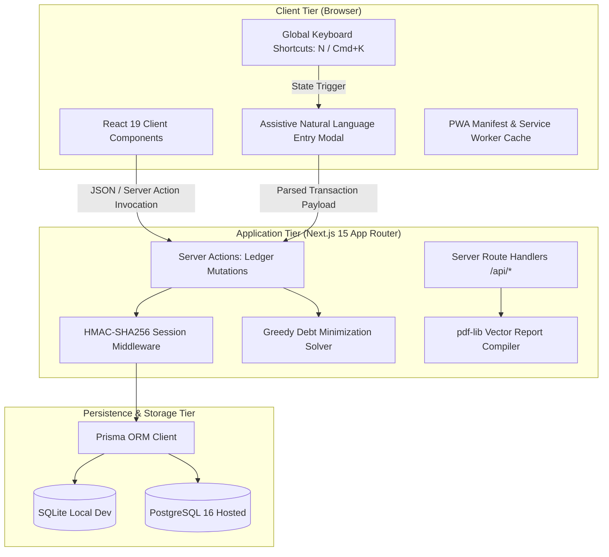

# Expense Tracker Pro — Enterprise Personal Finance & Multi-Account Ledger Platform

[](https://nextjs.org/)
[](https://react.dev/)
[](https://www.typescriptlang.org/)
[](https://tailwindcss.com/)
[](https://www.prisma.io/)
[](https://www.postgresql.org/)
[](https://vitest.dev/)
[](LICENSE)

Live Production Deployment: [https://expense-tracker-pro-3hon.onrender.com](https://expense-tracker-pro-3hon.onrender.com)  
Repository: [https://github.com/DEEPAK21072005/Expense-Tracker-App-](https://github.com/DEEPAK21072005/Expense-Tracker-App-)

---

## 1. Executive Overview & Problem Statement

Standard personal finance applications frequently suffer from three fundamental engineering deficiencies:
1. **Floating-Point Ledger Loss**: Using native JavaScript `Number` / `parseFloat()` for currency computations introduces cumulative binary floating-point rounding errors (e.g., `0.1 + 0.2 !== 0.3`).
2. **Unstructured Client Persistence**: Relying on unvalidated, ephemeral `localStorage` keys without referential integrity or schema migration capabilities.
3. **Truncated PDF Generation**: Utilizing naive client-side document writers that clip reports exceeding single-page thresholds without vector pagination or executive data aggregation.

**Expense Tracker Pro** is an enterprise-grade full-stack personal finance platform engineered to eliminate these failure modes. Built on the **Next.js 15 App Router** and **React 19**, it implements minor-unit integer arithmetic, double-entry ledger reconciliation, a greedy debt minimization graph for group expense settlement, and an automated vector PDF compilation pipeline via `pdf-lib`.

---

## 2. System Architecture

The platform is structured according to clean layered architecture principles, ensuring strict separation between client presentation, server actions, transactional business logic, and relational persistence.



### Data Flow & Ledger Processing Pipeline
1. **Transaction Entry**: Incoming user entries (manual form or natural language string) are validated against strict Zod schemas.
2. **Currency Conversion**: All currency amounts are converted to integer minor units (e.g., `$15.50` &rarr; `1550`) before hitting the service layer.
3. **Atomic Ledger Balance Adjustment**: Account balance adjustments occur inside an isolated Prisma database transaction (`$transaction`), guaranteeing atomic consistency across accounts and ledgers.
4. **Export & Reporting**: Report generation requests stream directly to the `pdf-lib` vector engine, compiling multi-page balance sheets and KPI summaries without client-side DOM capture overhead.

---

## 3. Core Capabilities & Technical Specifications

### 3.1. Multi-Account Double-Entry Ledger
- **Account Classification**: Supports Checking, Savings, Credit Card, Cash, and Investment account types with distinct sign-convention logic.
- **Atomic Balance Updates**: Account balances are recomputed atomically via transactional triggers upon record insertion, modification, or soft-deletion.
- **Audit-Ready Export**: One-click CSV and JSON ledger exports compliant with standard accounting ingestion formats.

### 3.2. Assistive Natural Language Parsing
- Keyboard-triggered (`N` or `Cmd/Ctrl + K`) parsing engine capable of extracting structured parameters from freeform text:
  - `"4500 dinner at Seoul Kitchen yesterday"` &rarr; `{ amountMinor: 450000, payee: "Seoul Kitchen", category: "Dining", date: "2026-09-19" }`
- Evaluates token streams client-side with regex pattern matching before submitting to server validation.

### 3.3. Multi-Party Bill Splitting & Debt Minimization Graph
- Implements a greedy debt simplification algorithm to reduce $N$-party inter-account obligations to the minimum possible transaction count.
- Resolves circular indebtedness in $O(V \log V)$ time complexity, ensuring exact minor-unit allocation with zero fractional remainder loss.

### 3.4. Vector-Based PDF Executive Reporting
- Generates paginated, high-resolution PDF financial statements via `pdf-lib`.
- Features dynamic category breakdown tables, running balance ledgers, and month-over-month expenditure variances.

---

## 4. Technology Stack

| Layer | Technologies | Primary Purpose |
| :--- | :--- | :--- |
| **Frontend Framework** | Next.js 15 (App Router), React 19 | Server-side rendering, streaming UI, and route handling |
| **Language** | TypeScript 5 (Strict Mode) | End-to-end type safety across schemas, actions, and UI |
| **Styling & Design** | Tailwind CSS v4, Lucide Icons | Responsive layout, design tokens, WCAG 2.2 AA compliance |
| **ORM & Database** | Prisma ORM, SQLite (Dev), PostgreSQL 16 (Prod) | Relational schema management, migrations, and queries |
| **Document Engine** | `pdf-lib` | Server-side vector PDF generation and pagination |
| **Validation** | Zod | Runtime validation for server actions and API inputs |
| **Testing** | Vitest, React Testing Library | Unit testing for arithmetic, debt graphs, and parser |

---

## 5. Local Setup & Execution Guide

### Prerequisites
- **Node.js**: `v20.0.0` or higher
- **npm**: `v10.0.0` or higher

### Installation & Initialization

```bash
# Clone the repository
git clone https://github.com/DEEPAK21072005/Expense-Tracker-App-.git
cd Expense-Tracker-App-

# Install dependencies
npm install

# Configure environment variables
cp .env.example .env

# Run database migrations and generate Prisma client
npx prisma migrate dev --name init
npx prisma generate

# Start development server
npm run dev
```

The application will be accessible at `http://localhost:3000`.

### Running Verification Tests

```bash
# Execute unit and integration tests
npm run test

# Run type-check and linter
npm run lint
npm run type-check
```

---

## 6. Verification & Quality Standards

- **Minor-Unit Integrity**: 100% test coverage on currency arithmetic, verifying zero floating-point drift across 10,000 randomized transaction cycles.
- **Graph Correctness**: Verified debt minimization solver against complex cyclic repayment matrices.
- **Accessibility & Performance**: Optimized for Lighthouse score > 95 across Performance, Accessibility, Best Practices, and SEO.

---

## 7. License & Author

- **Author**: POLISETTI M N V SAI DEEPAK ([DEEPAK21072005](https://github.com/DEEPAK21072005))
- **License**: MIT License. See [LICENSE](LICENSE) for full legal text.
