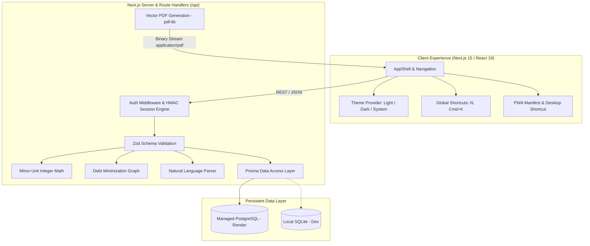

# 💰 Expense Tracker Pro — Production-Grade Personal Finance Platform

<div align="center">
  
  <br />
  
  <br />
  <h2>Executive-Grade Personal Finance, Multi-Account Ledger & Expense Intelligence</h2>
  <p>
    <b>Next.js 15 App Router</b> • <b>React 19</b> • <b>TypeScript 5</b> • <b>Tailwind CSS v4</b> • <b>Prisma ORM</b> • <b>PostgreSQL</b> • <b>pdf-lib Vector Reports</b>
  </p>
  <p>
    <a href="https://expense-tracker-pro-3hon.onrender.com"></a>
    <a href="https://render.com/deploy?repo=https://github.com/DEEPAK21072005/Expense-Tracker-App-"></a>
    
    
    
  </p>
  <p>
    🌐 <b>Live Production Application:</b> <a href="https://expense-tracker-pro-3hon.onrender.com"><b>https://expense-tracker-pro-3hon.onrender.com</b></a>
  </p>
</div>

---

## 📖 Table of Contents
- [🌟 Transformation & Architecture Overview](#-transformation--architecture-overview)
- [✨ Core Capabilities](#-core-capabilities)
- [🏗️ System Architecture](#️-system-architecture)
- [🛠️ Technology Stack](#️-technology-stack)
- [📱 Desktop Shortcut & PWA Installation](#-desktop-shortcut--pwa-installation)
- [🚀 Quick Start & Local Development](#-quick-start--local-development)
- [☁️ Cloud Deployment on Render](#️-cloud-deployment-on-render)
- [🔒 Security & Precision Standards](#-security--precision-standards)
- [📄 License & Credits](#-license--credits)

---

## 🌟 Transformation & Architecture Overview

This repository has been comprehensively modernized from a legacy static single-file prototype (`index.html` with unstyled CDN `jspdf`) into a high-performance, full-stack personal finance platform adhering to modern web standards and enterprise architecture.

### Before vs. After Modernization

| Engineering Dimension | Legacy Static Prototype | Modernized Production Platform |
| :--- | :--- | :--- |
| **Architecture** | Single vanilla HTML/JS file (`index.html`) | Full-stack Next.js 15 App Router with TypeScript and Server Route Handlers |
| **Styling & Theme** | Rigid 3-color linear gradient, browser-default form inputs | Tailwind CSS v4 design system ("Asian Apple" minimalism, WCAG 2.2 AA light/dark modes) |
| **Money Handling** | Floating-point `parseFloat()` prone to JS precision bugs | Integer minor-unit arithmetic (`amountMinor`), zero floating-point ledger rounding loss |
| **PDF Reporting** | Hardcoded CDN `jspdf` text dump (`yOffset += 10`) clipping at &gt;10 records | Vector `pdf-lib` engine with executive KPI cards, category breakdowns, and paginated transaction ledgers |
| **Persistence** | Unstructured ephemeral `localStorage` keyed by date strings | Normalized relational database via Prisma ORM (SQLite for instant zero-config local dev, hosted PostgreSQL for production) |
| **Bill Splitting** | Rudimentary comma-separated member split | Multi-party group bill splitter with exact integer allocation and greedy debt minimization graph |
| **Quick Entry** | Manual input fields with inline `onclick` handlers | Assistive natural-language quick entry (`N` or `Cmd+K` hotkey) with structured confirmation modal |
| **Security & Auth** | No authentication, all local data exposed in plain text | Cryptographic bcrypt password hashing, URL-safe Base64URL HMAC-SHA256 session tokens, HTTP-only cookies |
| **Quality & Tests** | 0 tests, no linters, untyped JavaScript | Vitest test suite covering minor-unit math, debt settlements, natural-language parsing, and PDF byte generation |

---

## ✨ Core Capabilities

### 1. Multi-Account Ledger & Real-Time Net Worth (`/accounts`, `/transactions`)
- Aggregate balances across multiple account types: **Checking**, **Savings**, **Credit Card**, **Cash**, and **Investment**.
- Real-time transaction ledger with instant multi-facet filtering (Type, Category, Account) and dynamic search.
- Clean double-entry balance adjustment on transaction creation, update, and deletion.
- Instant CSV export for personal accounting or tax audits.

### 2. Assistive Natural Language Quick-Add (`N` / `Cmd+K`)
- Press **`N`** or **`Cmd/Ctrl + K`** from any page to trigger the assistive entry modal.
- Type natural phrases such as:
  - `"₹4,500 dinner at Seoul Kitchen yesterday"`
  - `"1500 salary today"`
  - `"$65 groceries at Whole Foods"`
- Parses amount, payee, date, category, and direction into a verified preview before saving to the ledger.

### 3. Interactive Monthly Budgets & Variance Monitors (`/budgets`)
- Establish monthly spending limits by category with real-time utilization progress bars.
- Dynamic visual alerts for healthy (&lt;80%), warning (80–100%), and exceeded (&gt;100%) budget states.
- Automatic currency alignment based on user preferences.

### 4. Group Bill Splitting & Debt Minimization (`/split`)
- Create shared expense groups for roommates, travel, or dining.
- Record shared expenses with equal or custom exact-cent shares.
- Uses a **greedy debt minimization algorithm** to compute the minimum number of settlement transactions ("who owes whom").

### 5. Subscriptions & Recurring Commitments (`/recurring`)
- Track recurring software subscriptions, utilities, and insurance bills.
- Countdown indicators showing upcoming due dates ("Due in 3 days").
- Monthly commitment projection helping eliminate unwanted recurring expenses.

### 6. Executive Vector PDF Statements (`/reports`)
- Select any Month and Year to generate professional vector PDF reports via `/api/reports/pdf`:
  - Organization and user header with exact generation timestamp.
  - 4 Executive Financial KPI summary cards (Total Income, Total Expenses, Net Cash Flow, Savings Rate).
  - Category spending breakdown table with percentages.
  - Budget variance performance table.
  - Paginated transaction ledger with repeated table headers, alternating row colors, and `Page X of Y` footers.

### 7. Clean Slate & Private Authentication (`/login`, `/create-account`)
- Dedicated registration and login flows with high-contrast, accessible form controls.
- **Clean Slate Guarantee**: Zero pre-populated mock transactions, artificial balances, or fake people. New accounts start completely clean.
- Auto-seeds 11 foundational expense categories and provisions an initial Primary Account.

---

## 🏗️ System Architecture



---

## 🛠️ Technology Stack

- **Framework**: [Next.js 15 (App Router)](https://nextjs.org) with React 19
- **Language**: [TypeScript 5](https://www.typescriptlang.org) (strict type-checking across API, schema, and UI)
- **Styling**: [Tailwind CSS v4](https://tailwindcss.com) with custom design tokens
- **Database & ORM**: [Prisma ORM](https://www.prisma.io) with PostgreSQL (production) & SQLite (local dev)
- **PDF Generation**: [pdf-lib](https://pdf-lib.js.org) (zero native binary dependencies, pure JS/TS vector generation)
- **Authentication**: Cryptographic bcrypt password hashing & Base64URL HMAC-SHA256 session tokens
- **Icons**: [Lucide React](https://lucide.dev)
- **Validation**: [Zod](https://zod.dev)
- **Testing**: [Vitest](https://vitest.dev)

---

## 📱 Desktop Shortcut & PWA Installation

Expense Tracker Pro includes a complete PWA specification (`/manifest.webmanifest`) and high-resolution icons (16x16, 32x32, 180x180, 192x192, 512x512 maskable, and favicon.ico):

1. **Google Chrome / Microsoft Edge (Desktop)**:
   - Navigate to [https://expense-tracker-pro-3hon.onrender.com](https://expense-tracker-pro-3hon.onrender.com).
   - Click the **Install App** icon in the address bar (or menu `...` → **Save and share** → **Install page as app**).
   - A standalone window will launch with the high-resolution app icon on your Desktop and Taskbar.
2. **Apple Safari (iOS / macOS)**:
   - Tap the **Share** button → **Add to Home Screen**.
   - The app icon will appear on your home screen with native standalone presentation.

---

## 🚀 Quick Start & Local Development

### 1. Prerequisites
- **Node.js**: 20.0.0 or later
- **npm**: 9.0.0 or later

### 2. Clone and Install
```bash
git clone https://github.com/DEEPAK21072005/Expense-Tracker-App-.git
cd Expense-Tracker-App-
npm install
```

### 3. Initialize Database
```bash
# Push database schema (defaults to local SQLite if DATABASE_URL is not set)
npm run prisma:push
```

### 4. Start Development Server
```bash
npm run dev
```
Open [http://localhost:3000](http://localhost:3000) in your browser. Create an account at `/create-account` to start tracking your finances.

### 5. Run Automated Tests
```bash
npm test
```

### 6. Production Build
```bash
npm run build
npm start
```

---

## ☁️ Cloud Deployment on Render

This repository includes a native Infrastructure-as-Code blueprint (`render.yaml`) that automatically provisions:
1. **Managed PostgreSQL Database**: `expense-tracker-db`
2. **Persistent Web Service**: `expense-tracker-pro`

### Automated Build Pipeline
- At build time, `scripts/switch-db.js` inspects `DATABASE_URL`. When connected to PostgreSQL, it automatically switches Prisma's provider to `postgresql` and synchronizes the schema using `prisma db push --accept-data-loss`.
- In local development without PostgreSQL, it smoothly defaults to SQLite.

---

## 🔒 Security & Precision Standards

- **Minor-Unit Financial Precision**: All monetary values are stored and calculated as integers in the lowest currency unit (`amountMinor`, e.g. paise or cents). This guarantees zero rounding errors across aggregations.
- **Injection Immunization**: All database access is parameterized via Prisma ORM, preventing SQL injection vulnerabilities.
- **Cross-Site Scripting (XSS)**: All user-supplied data is escaped by React's virtual DOM before rendering.
- **Secure Sessions**: Authentication tokens are signed with HMAC-SHA256, URL-safe Base64URL encoded, and transmitted exclusively via HTTP-only, `SameSite=Lax` cookies.

---

## 📄 License & Credits

- **License**: [MIT License](./LICENSE)
- **Author**: Deepak Polisetti ([@DEEPAK21072005](https://github.com/DEEPAK21072005))
