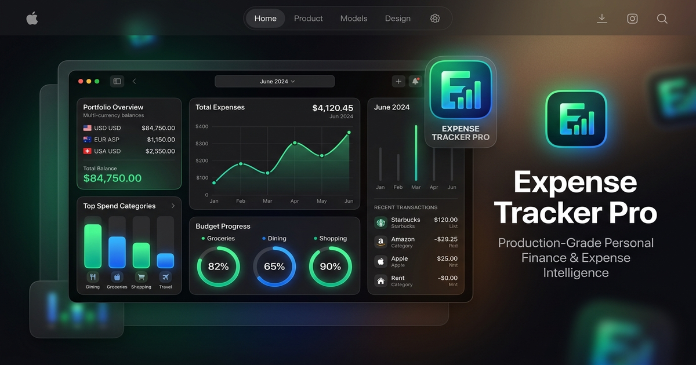
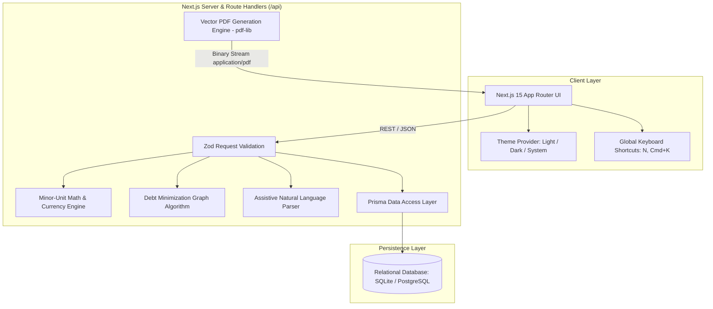

# 💰 Expense Tracker Pro — Current-Generation Personal Finance Platform

<div align="center">
  
  <br />
  
  <br />
  <h3>Executive-Grade Personal Finance & Expense Intelligence</h3>
  <p>
    <b>Next.js 15 App Router</b> • <b>React 19</b> • <b>TypeScript</b> • <b>Tailwind CSS v4</b> • <b>Prisma ORM</b> • <b>pdf-lib Vector Reports</b>
  </p>
  <p>
    <a href="https://vercel.com/new/clone?repository-url=https%3A%2F%2Fgithub.com%2FDEEPAK21072005%2FExpense-Tracker-App-"></a>
  </p>
</div>

---

## 🌟 Executive Summary & Transformation Overview

This repository has been comprehensively modernized from a legacy static prototype (`index.html` + unstyled CDN `jspdf`) into an executive-grade personal finance application adhering to the deep research architecture specification.

### Before vs. After Modernization

| Aspect | Legacy Application | Modernized Production Platform |
| :--- | :--- | :--- |
| **Architecture** | Static vanilla HTML/JS single-page file (`index.html`) | Full-stack Next.js App Router (v15) with TypeScript and Route Handlers |
| **Styling & Theme** | Rigid 3-color linear gradient, unstyled HTML inputs | Tailored Tailwind CSS v4 design system ("Asian Apple" minimalism, WCAG 2.2 AA light/dark modes) |
| **Money Handling** | Floating-point `parseFloat()` prone to JS precision bugs | Integer minor-unit arithmetic (`amountMinor`), zero floating-point ledger rounding loss |
| **PDF Reporting** | Hardcoded CDN `jspdf` text dump with `yOffset += 10`, clipping at &gt;10 records | Pure vector `pdf-lib` engine with executive summary cards, category distributions, budget variance, and multi-page paginated transaction ledgers with repeated table headers |
| **Persistence** | Unstructured `localStorage` keyed by single date strings (`YYYY-MM-DD`) | Normalized relational database via Prisma ORM (SQLite for instant zero-config local run, Postgres compatible) |
| **Bill Splitting** | Rudimentary comma-separated member split | Multi-member group expense splitter with exact cent allocation and greedy debt minimization graph ("who owes whom") |
| **Quick Entry** | Manual input fields with inline `onclick` handlers | Assistive natural-language quick entry ("₹450 dinner at Seoul Kitchen yesterday") with interactive confirmation |
| **Quality & Tests** | 0 tests, no linters, no types | Vitest test suite covering minor-unit math, debt settlements, natural-language parsing, and PDF byte generation |

---

## 🏗️ System Architecture



---

## 🛠️ Technology Stack

- **Framework**: [Next.js 15 (App Router)](https://nextjs.org) with React 19
- **Language**: [TypeScript 5](https://www.typescriptlang.org) (strict type-checking across API, schema, and UI)
- **Styling**: [Tailwind CSS v4](https://tailwindcss.com) with custom design tokens
- **Database & ORM**: [Prisma ORM](https://www.prisma.io) with SQLite (PostgreSQL compatible)
- **PDF Generation**: [pdf-lib](https://pdf-lib.js.org) (zero native binary dependencies, pure JS/TS vector generation)
- **Icons**: [Lucide React](https://lucide.dev)
- **Validation**: [Zod](https://zod.dev)
- **Testing**: [Vitest](https://vitest.dev)

---

## 🚀 How to Run Locally

### 1. Prerequisites
- Node.js 18+ (tested on Node v22.18.0)
- npm 9+

### 2. Install Dependencies
```bash
npm install
```

### 3. Initialize & Seed Database
```bash
npx prisma db push
node prisma/seed.js
```
*(The seed script populates curated default categories, sample accounts, active budgets, and realistic demo transactions).*

### 4. Start Development Server
```bash
npm run dev
```
Open [http://localhost:3000](http://localhost:3000) in your browser.

### 5. Run Automated Tests
```bash
npm test
```

### 6. Production Build
```bash
npm run build
npm start
```

---

## 🎯 Key Feature Highlights

### 1. Executive Financial Dashboard (`/`)
- Total Net Worth aggregated across all Cash, Bank, Savings, and Credit accounts.
- Month-to-date Income, Expenses, Net Cash Flow, and Savings Rate (%).
- Category spending distribution with visual progress indicators.
- Budget health variance monitors with warning alerts.
- Group bill settlement snapshot.

### 2. Full Transaction Ledger & Search (`/transactions`)
- Real-time search across payee, memo, and categories.
- Filter chips: Type (Income, Expense, Transfer), Category, and Account.
- Filtered totals summary cards.
- Instant CSV export of ledger data.
- Atomic balance recalculation on creation and deletion.

### 3. Assistive Natural Language Quick-Add
- Press **`N`** or **`Cmd/Ctrl + K`** from any page to trigger quick entry.
- Enter expressions like:
  - `"₹450 dinner at Seoul Kitchen yesterday"`
  - `"1500 salary today"`
  - `"$45.50 groceries at Whole Foods"`
- Displays a structured preview for user verification before persisting to the ledger.

### 4. Modern Group Expense Splitter (`/split`)
- Preserves and upgrades the legacy "Expense Mode".
- Create groups for roommates, team dinners, or travel.
- Supports equal and custom exact shares with zero-remainder integer allocation.
- Computes automated settlement transactions ("who owes whom") using a greedy debt minimization algorithm.

### 5. Executive Monthly PDF Statements (`/reports`)
- Select any Month and Year.
- Generates professional vector PDFs via `/api/reports/pdf`:
  - Organization and user header with generation timestamp.
  - 4 Executive financial KPI cards.
  - Category spending breakdown table.
  - Budget variance performance table.
  - Paginated transaction ledger with repeated table headers, alternating row colors, and `Page X of Total` footers.

### 6. Subscriptions & Recurring Bills (`/recurring`)
- Track subscriptions (Cloud storage, Spotify, Gym, Rent).
- Next due date countdowns ("Due in 4 days").
- Monthly commitment projection.

### 7. Settings & Data Sovereignty (`/settings`)
- One-click automatic migration of legacy `localStorage` data (`monthlyData`).
- Export full JSON database backups.
- Restore from JSON snapshots.

---

## 🔒 Security & Quality Assurance

- **OWASP Top 10**: Parameterized SQL queries via Prisma ORM immunize against SQL injection. HTML outputs are React-escaped to prevent XSS. Security headers configured in `next.config.ts`.
- **Accessibility**: WCAG 2.2 AA contrast compliance, semantic HTML, visible focus rings, and keyboard navigation.
- **Precision**: Money arithmetic is calculated in integer minor units (paise/cents) to eliminate JavaScript floating-point errors.

---

## 📄 License
MIT License - see [LICENSE](file:///c:/Users/polis/OneDrive/Desktop/Personal/.vscode/EXPENSE-TRACKER-APP&WEB%20PAGE/LICENSE) for details.
